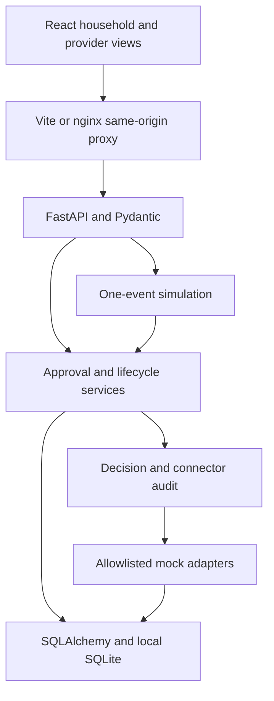

# Architecture

## Boundaries

React pages render API state through TanStack Query. Every mutation invalidates related records; failed guarded mutations also invalidate to expose denial audits. A typed API client handles FastAPI validation errors. React Router supplies deep links; Vite and nginx preserve same-origin API paths. Tailwind and shared CSS tokens provide responsive desktop/mobile layout without a component-library dependency.

FastAPI routes validate Pydantic inputs and serialize response models. `services/approvals.py` owns scoped permission, consume-once actions and idempotency; `services/lifecycle.py` owns evidence/confirmation/closure; `services/simulation.py` advances the documentary script; `services/workspace.py` owns persistent household/asset/provider management, explicit quotes, provider reports and pre-assignment cancellation; `services/audit.py` records decisions and sanitized connectors. `agent/prompt.py` is the canonical prompt displayed through `/api/system-prompt`, not a duplicate frontend copy. `agent/providers.py` defines the future model interface: a model proposes classification but has no authority to bypass services.

## Persistence

Alembic owns schema versioning. Migration `0002_working_model` adds appliance category, provenance and service plan fields to existing database rows without deleting their prior values. `scripts/backup_db.py` uses SQLite's consistent backup API before upgrading a user's database. SQLAlchemy entities cover Household, Participant, Asset, ServiceCase, CaseEvent, Decision, Evidence, Approval, ConnectorCall, Provider and Notification. Supporting entities include ActionReceipt, SimulationState and consented Signup. UTC timestamps, primary/foreign keys, constrained status/label values and unique approval receipts protect basic consistency. Model/migration parity is tested.

A new case has no selected provider or quote until an explicit local provider submission. An eligible provider's trade must match the appliance category. A case's service revision associates approvals and evidence with the current provider/service. Changing providers invalidates assignment, confirmations and old authorization scope. A rejected or stale request cannot be silently replaced by a successful action. A unique action receipt ensures replaying payment does not create another mock payment.

SQLite uses foreign-key enforcement and `BEGIN IMMEDIATE` to serialize check-and-consume across local workers. Errors roll back the transition before persisting a safe denial decision. This intentionally prioritizes correctness over read concurrency in the local demo. Connector mocks have no external effects, so rollback can truly leave no partial external action; this **would not be true of real payments**. Live adapters require an outbox, remote idempotency and reconciliation.

## Manual versus scripted completion

Manual non-demo cases progress from `awaiting_quote` through a revision-bound quote, household spend approval, mock assignment, local provider service report and two independent confirmations. A provider's report is labeled `REAL_HUMAN_INPUT` but is not independent proof of identity or an actual visit. A new report clears old confirmation flags. Unassigned cancellation preserves the record and revokes unused permissions. The six-step RK-2048 script remains untouched.

## PostgreSQL migration seam

The domain uses SQLAlchemy models/session boundaries rather than handwritten SQLite application queries. Nonetheless PostgreSQL is not currently enabled: settings fail closed on non-SQLite URLs. To migrate: add a PostgreSQL driver/configuration, remove local path validation for that dialect, replace SQLite PRAGMAs and writer reservation with row locks/transaction isolation, verify migrations/types/constraints against PostgreSQL, and repeat concurrency/idempotency tests. Do not just switch the URL and claim support.

## Deterministic simulation

Six initial events establish intake, classification, history lookup, provider choice, quote and request. Each `/simulation/next` adds one documentary event and its supporting decisions/records. Stable demo IDs/timestamps make reset/replay reproducible. Reset only deletes/recreates demo workflow records; other cases, signups and shared reference records remain. A rejected approval or unresolved human report blocks automatic progression.

## Production gap

The application has production-oriented layers, tests and migration tooling, but no production identity, tenant access control, external worker infrastructure, encrypted evidence storage or real-provider verification. Loopback binding, mock-only settings and clear labeling prevent presenting this as a hosted operational service. `X-Demo-Role` is attribution only and can be omitted/spoofed. CORS is not authorization.
